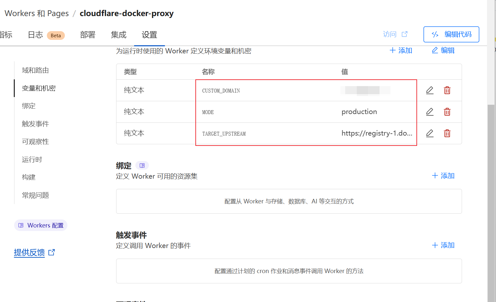

部署参考：
- https://jerry.xin/202406/%E5%BB%BA%E7%AB%8B%E8%87%AA%E5%B7%B1%E7%9A%84docker%E9%95%9C%E5%83%8F%E5%8A%A0%E9%80%9F%E6%9C%8D%E5%8A%A1%EF%BC%9Acloudflare-docker-proxy/
- https://www.cnblogs.com/KubeExplorer/p/18264358#%E4%BD%BF%E7%94%A8%E8%AF%B4%E6%98%8E
- https://github.com/lixd/cloudflare-docker-proxy

下图中的环境变量可能需要手动修改



# cloudflare-docker-proxy


[](https://deploy.workers.cloudflare.com/?url=https://github.com/ersutUp/cloudflare-docker-proxy)

> If you're looking for proxy for helm, maybe you can try [cloudflare-helm-proxy](https://github.com/ciiiii/cloudflare-helm-proxy).

## Deploy

1. click the "Deploy With Workers" button
2. follow the instructions to fork and deploy
3. update routes as you requirement

[](https://deploy.workers.cloudflare.com/?url=https://github.com/ersutUp/cloudflare-docker-proxy)

## Routes configuration tutorial

1. use cloudflare worker host: only support proxy one registry
   ```javascript
   const routes = {
     "${workername}.${username}.workers.dev/": "https://registry-1.docker.io",
   };
   ```
2. use custom domain: support proxy multiple registries route by host
   - host your domain DNS on cloudflare
   - add `A` record of xxx.example.com to `192.0.2.1`
   - deploy this project to cloudflare workers
   - add `xxx.example.com/*` to HTTP routes of workers
   - add more records and modify the config as you need
   ```javascript
   const routes = {
     "docker.libcuda.so": "https://registry-1.docker.io",
     "quay.libcuda.so": "https://quay.io",
     "gcr.libcuda.so": "https://k8s.gcr.io",
     "k8s-gcr.libcuda.so": "https://k8s.gcr.io",
     "ghcr.libcuda.so": "https://ghcr.io",
   };
   ```

